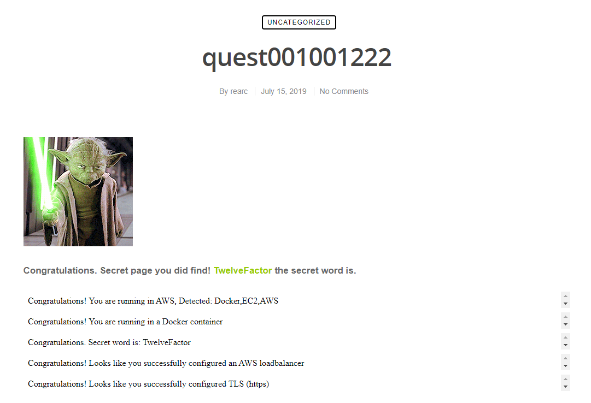

# Rearc Quest Exploration

This is an exploration of [https://github.com/rearc/quest](https://github.com/rearc/quest).

## Running the AWS Terraform IaC

1. Download the files from `terraform_deployment` into a directory.
2. [Download and install Terraform](https://www.terraform.io/downloads).
3. Run `terraform init` within the `terraform_deployment` directory using a terminal.
4. Set your own `access_key`, `secret_key`, and `ssh_public_key` by making a new `terraform.tfvars` file within `terraform_deployment`. Any other variables from `variables.tf` can be customized in `terraform.tfvars` too. You can set a variable in `terraform.tfvars` using a line-by-line format like `access_key = "AW3JLRW29FJE4WP9A"`.
5. Run `terraform plan` to view the possible changes, and `terraform apply -auto-approve` to automatically approve these changes and run the IaC.
6. Visit the application load balancer's DNS, which should be outputted on the terminal.

Note that some of these steps take some time for provisioning, health checks, etc. before the app is live.

To remove the infrastructure, you can first comment out the code after the `aws` provider configurations. Then, run `terraform plan` to check if Terraform will destroy the same resources. Finally, run `terraform apply -auto-approve` to destroy the same resources.

## Quest Submission

### Work Assets

- IaC files in `/terraform_deployment`, `Dockerfile`, and `README.md` (+personal notes in `notes.md`) located at [https://github.com/rzmk/rearc-quest](https://github.com/rzmk/rearc-quest).

### Proof of Completion

- AWS public cloud deployment link may be located in the GitHub repository description. Note that there may be a warning due to the TLS certificate being self-signed but this can be bypassed by dismissing the warning.
- Code located at [https://github.com/rzmk/rearc-quest](https://github.com/rzmk/rearc-quest).
- Screenshot:

### Prompt Answer

Given more time, I would improve the Dockerfile, environment variable injection, Terraform variables and other concepts, and looking into the TLS certificate expiry/renewal process. These areas are where I found there could be improvements made. I would also improve my quest by completing it with other cloud providers like Azure and GCP. Here are more details on how I'd improve certain aspects of my quest:

- **Dockerfile** - I think instead of copying files from the current repository since I already downloaded them from git, I would instead do so within the Dockerfile. I would also review Docker concepts more to see if I can make the code more efficient or following better practices.
- **Environment variable injection** - The `SECRET_WORD` is already exposed on the index page so I assume it's not that important to keep this word too secret. However, I would look into different ways to keep secrets safe like with AWS Secrets Manager. [This article](https://blog.gruntwork.io/a-comprehensive-guide-to-managing-secrets-in-your-terraform-code-1d586955ace1) was shared by my Terraform instructor to help explain managing secrets with Terraform that I would explore along with searching how to manage Docker secrets.
- **Terraform variables and other concepts** - I haven't completed the Terraform course but I still tackled the IaC step. I think if I continue the course and review my code to make it better (i.e., variable use cases) then it may be easier to understand or more efficient.
- **TLS certificate** - I still have a warning that shows up when accessing the ELB DNS through HTTPS and I'm assuming it's due to the self-signed certificate. Maybe there's a way to bypass this with ACM using requested certificates or other methods that I would explore. Also, the certificate may expire within a certain timeframe so I may need to consider automating SSL certificate renewal but I haven't looked into this concept too much.
